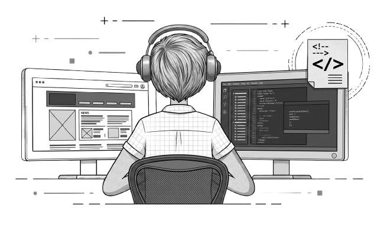

  

  <h1>Hello I'm Yakup</h1>
  
  
I am a Full-Stack Web Developer and a Statistics student at Fırat University who is passionate about creating modern, scalable, and visually engaging digital experiences. Since my early years, I have been deeply interested in computers, web technologies, and software development. My goal is to combine software engineering with AI-driven systems and analytical thinking to create impactful, innovative, and intelligent applications.

  

    
    
    
  

 

### 💫 About Me

<table align="center" width="100%">
  <tr>
    <td width="60%" valign="top">
      
🌱 I am currently honing my programming skills through active development.

      
🛠️ Experienced in <b>Web Development</b> and <b>Front-End</b> architecture.

      
⚡ Passionate about <b>Artificial Intelligence, Machine Learning, Data Science, Automation,</b> and <b>Blockchain</b>.

      
✨ Driven by a commitment to <b>perfection</b> in every line of code.

    </td>
    <td width="40%" align="center">
      
    </td>
  </tr>
</table>

 

### 📚 Languages & Tools I Have Placed My Hands On

  

